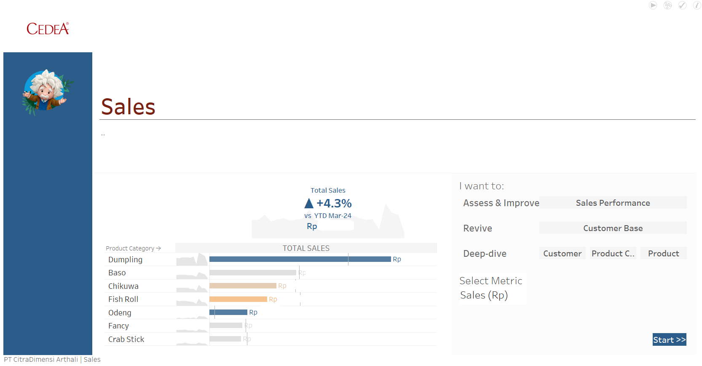

# 📈 Sales Order Data Migration & Visualization

This project bridges historical and current sales order data from **Accurate ERP** and **Odoo ERP**, preparing it for **Tableau** dashboard visualization:

1. **sale_order_history.sql**: Extracts historical sales orders from **Accurate**.
2. **sale_order_odoo.sql**: Fetches current sales orders from **Odoo**.
3. **sale_order_tableau_accelerator_sales.sql**: Joins and prepares the unified dataset for Tableau analysis.
4. **Home.png**, **Executive Summary.png**, **Customer Base.png**: Samples of the Tableau dashboard built from the combined data.

> This is a portfolio project. Sensitive data has been excluded or replaced to respect company confidentiality.

---

## 🔧 Tech Stack

- **SQL**: Data extraction and transformation
- **Accurate ERP**: Legacy ERP system (historical data source)
- **Odoo ERP**: Current ERP system (live data source)
- **Tableau**: Visualization and dashboarding

---

## 🚀 Project Workflow

flowchart TD
    AccurateDB[(Accurate ERP Database)] --> HistoryQuery[sale_order_history.sql]
    OdooDB[(Odoo ERP Database)] --> OdooQuery[sale_order_odoo.sql]
    HistoryQuery --> JoinQuery[sale_order_tableau_accelerator_sales.sql]
    OdooQuery --> JoinQuery
    JoinQuery --> Tableau[Tableau Dashboard]

---

## 📸 Dashboard Previews

Some highlights from the final dashboard:

| Home | Executive Summary | Customer Base |
|:----:|:-----------------:|:-------------:|
|  |  |  |

> Note: Only selected views are shared publicly to protect sensitive business information.

---
